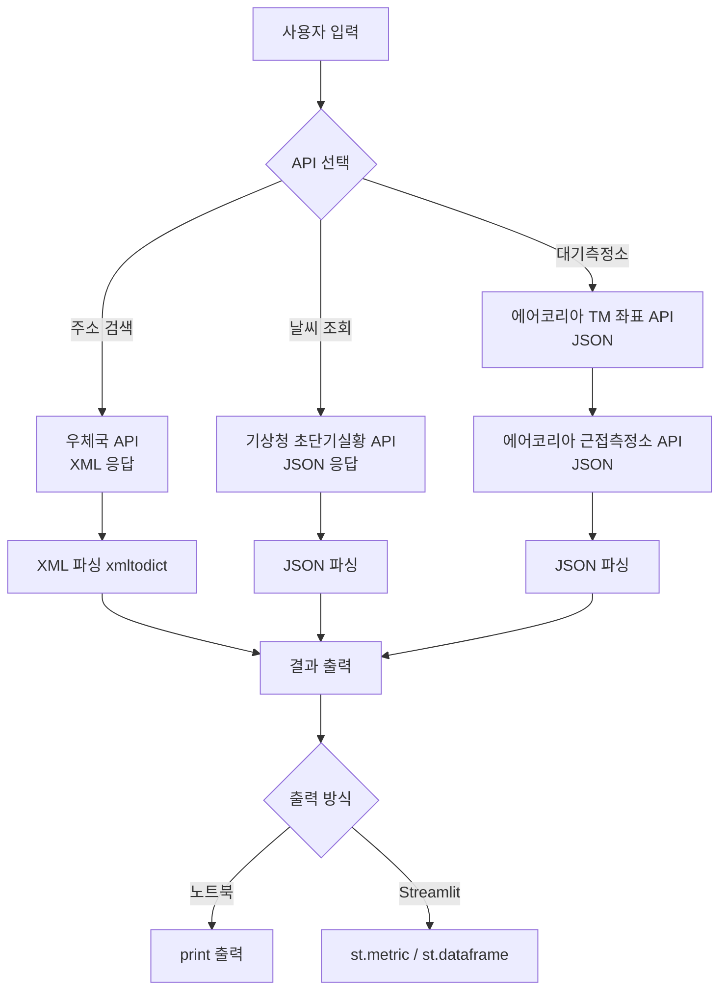
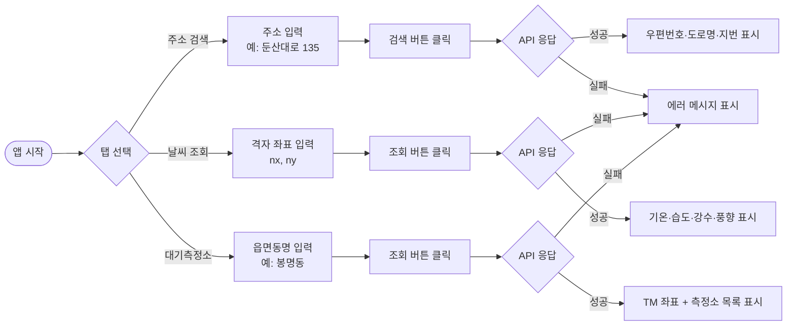

# PRD — 공공 Web API 실습 프로젝트

> 버전: v1.1 | 작성일: 2026-04-06 | 최종수정: 2026-04-06 | 작성자: sanguinekim

---

## 배포 현황

| 항목 | 내용 |
|------|------|
| GitHub | https://github.com/kimsanguine/260406_webapi_practice |
| Streamlit Cloud | streamlit/app.py, Python 3.11 |
| API Key 관리 | st.secrets(클라우드) / .env(로컬) 자동 감지, UI 노출 없음 |
| 버그 수정 | BUG-01~05 전부 수정 완료 |

---

## 1. 개요

### 배경
`WebAPI실습_수정본.ipynb`는 공공데이터포털 3종 API(우체국·기상청·에어코리아)를 순차 실습하는 강의용 노트북이다. 현재 버그 5건, 코드 중복, 에러 처리 부재 등 품질 문제가 있으며 강의 실시간 데모로 사용하기 어려운 상태다.

### 목표
1. 버그를 수정한 정제 노트북 제공 (강의 참고자료)
2. Streamlit 인터랙티브 앱으로 발전 (실시간 강의 데모)

### 사용자
- **강사**: API 호출 원리 설명, 실시간 결과 시연
- **수강생**: 주소/날씨/대기 데이터를 직접 조회하며 API 구조 이해

---

## 2. 기능 요구사항

| ID | 기능 | 설명 | 우선순위 |
|----|------|------|----------|
| FR-01 | 주소 검색 | 도로명/지번 주소 입력 → 우편번호·도로명주소·지번주소 반환. 복수 결과 전체 표시 | Must |
| FR-02 | 날씨 조회 | 격자 좌표(nx, ny) 입력 → 기온·습도·강수·풍향·풍속 반환. 발표 날짜·시간 표시 | Must |
| FR-03 | 대기측정소 조회 | 읍면동명 입력 → TM 좌표 조회 → 근접 측정소 목록(이름·거리·주소) 반환 | Must |
| FR-04 | API Key 관리 | `.env` 파일 기반 키 관리. 코드 내 하드코딩 금지 | Must |
| FR-05 | 에러 처리 | API 실패·네트워크 오류 시 명확한 한국어 에러 메시지 표시 | Should |
| FR-06 | Streamlit UI | 탭 기반 UI. 주소/날씨/대기측정소 탭 분리 | Should |

---

## 3. 비기능 요구사항

| ID | 항목 | 기준 |
|----|------|------|
| NF-01 | 코드 재사용성 | 각 API를 독립 함수로 모듈화 (`api/` 디렉터리) |
| NF-02 | 강의 친화성 | Streamlit `st.metric`, `st.dataframe`으로 결과 시각화 |
| NF-03 | 보안 | API Key를 `.env`로 분리, `.gitignore`에 등록 |
| NF-04 | 호환성 | Python 3.10+, Streamlit 1.x |

---

## 4. 현황 버그 목록

| ID | 위치 | 버그 내용 | 심각도 |
|----|------|-----------|--------|
| BUG-01 | cell-14 | `output_type : 'json'` → `:` 대신 `=` 사용. 변수 미할당으로 하위 API 호출 실패 | Critical |
| BUG-02 | cell-9 | `sky_cond[obsrValue]-1` → obsrValue가 str이므로 `int(obsrValue) - 1` 필요 | High |
| BUG-03 | cell-8 | 시간 로직 반전. `minute >= 30`이면 현재 시간 사용해야 하나 코드는 반대 | High |
| BUG-04 | cell-0/6/10 | API_KEY 셀 3회 중복 정의 | Low |
| BUG-05 | cell-9 | RN1(강수량)·UUU(동서바람)·VEC(풍향) 카테고리 출력 누락 | Low |

---

## 5. 시스템 플로우 (Mermaid)

### 5-1. 시스템 관점

### 5-2. 유저 플로우

---

## 6. 개발 Phase

### Phase 1 — 버그 수정 노트북 (`fixed/webapi_fixed.ipynb`)
- BUG-01~05 수정
- API_KEY 중복 제거
- 하드코딩 값 변수화

### Phase 2 — 모듈화 + .env
- `api/address.py` — 우체국 주소 검색
- `api/weather.py` — 기상청 날씨
- `api/airkorea.py` — 에어코리아 TM 좌표 + 측정소
- `.env` 기반 키 로드 (`python-dotenv`)
- 각 함수 `try/except` 에러 핸들링

### Phase 3 — Streamlit 앱
- `streamlit/app.py` — 3탭 UI
- 사이드바: API Key 입력 (`.env` 없을 때 fallback)
- 결과: `st.metric`, `st.dataframe`, `st.json`

---

## 7. 검증 기준

| 항목 | 검증 방법 |
|------|-----------|
| Phase 1 | `fixed/webapi_fixed.ipynb` 전체 셀 실행 → 오류 없음 |
| Phase 2 | 각 `api/*.py` 직접 실행 → 정상 응답 확인 |
| Phase 3 | `streamlit run streamlit/app.py` → 3탭 동작, API 응답 표시 확인 |
